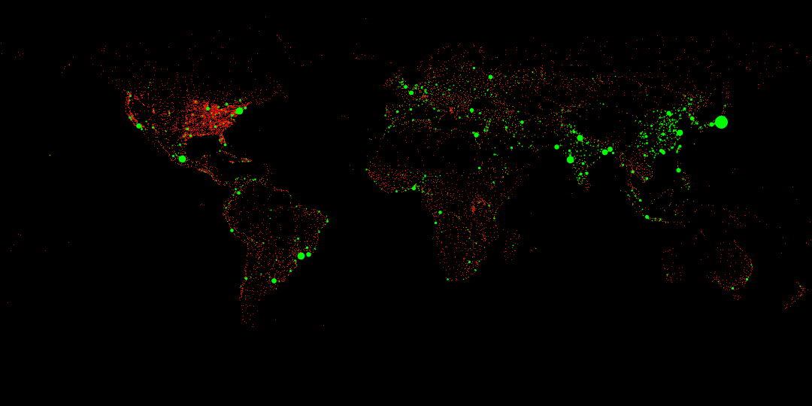

### The dataset
The wordcities.csv dataset contains 11,276 cities around the world. For every city its name, name in ascii, country, latitude, longitude, and population is provided.

### How it is visualized
A city is represented by a dot that is draw at its coordinates. Every three pixels is equivalent to one degree.

The color of a dot is on a gradient that goes from red (r=255, g=0, b=0) to green (r=0, g=255, b=0). Where red corresponds to a population of zero and green is any population greater than one million.

The size of the dot is determined by mapping a population of zero to a dot size of one pixel and a population of twenty million to a dot size of ten pixels. This results in the formula: `dot size = 5E-7 × population + 1`.
